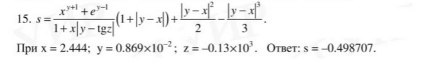
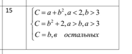

# VSUET. Yudkin Mihail Dmitrievich. Group Um - 242

## Practical lesson 1
Ссылка на выполненное задание: [Практический урок 1](./Practical_lesson_1.py)
### Task
1) Установите Python https://www.python.org/ftp/python/3.8.5/python-3.8.5.exe
2) Напишите программу, которая запрашивала бы у пользователя:
Имя, Фамилия, Возраст, Место жительства
- фамилия, имя ( "Ваши фамилия, имя?")
- возраст ("Сколько Вам лет?")
- место жительства ("Где вы живете?")
После этого выводила бы три строки:
"Ваши фамилия, имя"
"Ваш возраст"
"Вы живете в"

## Practical lesson 2
Ссылка на выполненное задание: [Практический урок 2](./Practical_lesson_2.py)
### Task
#### Variant 15



## Practical lesson 3
Ссылка на выполненное задание: [Практический урок 3](./Practical_lesson_3.py)
### Task 1.1 
Даны три целых числа. Выбрать из них те, которые принадлежат интер валу[1,3].
### Task 1.2
Напишите программу, которая опре деляет, состоит ли двузначное число, введенное с клавиатуры из одинаковых цифр. Если состоит, то программа выведет «Да», в противном случае выведет «Нет».
### Task 2
#### Variant 15

### Task 3
#### Variant 18
Задание: Определение, является ли введенное число целым или дробным.


## Practical lesson 4
Ссылка на выполненное задание: [Практический урок 4](./Practical_lesson_4.py)
### Task
#### Variant 10
Пользователь вводит два числа N и K с клавиатуры. N - количество чисел из
ряда Фибоначчи, K - порядковый номер в ряду, с которого нужно начать. Посчитайте
сумму этих чисел. В решении этой задачи можно использовать только один цикл.


## Practical lesson 5
Ссылка на выполненное задание: [Практический урок 5](./Practical_lesson_5.py)
### Task
#### Variant 15
Дана строка текста. Подсчитать количество букв «т» в строке.


## Practical lesson 6
Ссылка на выполненное задание: [Практический урок 6](./Practical_lesson_6.py)
### Variant 15
#### Task 1 
Определите, есть ли в списке повторяющиеся элементы, если да, то вывести
на экран эти значения.
#### Task 2
Дан одномерный массив целого типа. Получить другой массив, состоящий
только из нечетных чисел исходного массива или сообщить, что таких чисел нет.
Полученный массив вывести в порядке убывания элементов.


## Practical lesson 7
Ссылка на выполненное задание: [Практический урок 7](./Practical_lesson_7.py)
### Variant 15
#### Task 1 
Найти все простые натуральные числа, не превосходящие n, двоичная запись
которых представляет собой палиндром, т. е. читается одинаково слева
направо и справа налево.
#### Task 2
Четыре точки заданы своими координатами X(x1, x2, x3), Y(y1, y2, y3), Z(z1, z2,
z3), T(t1,t2, t3). Выяснить, какие из них находятся на минимальном расстоянии
друг от друга и вывести на экран значение этого расстояния. Вычисление
расстояния между двумя точками оформить в виде процедуры.


## Practical lesson 8
Ссылка на выполненное задание: [Практический урок 8](./Practical_lesson_8.py)
### Variant 15
#### Task 1 
Определить номера строк матрицы R[M, N], хотя бы один элемент
которых равен с, и элементы этих строк умножить на d.
#### Task 2
Среди тех строк целочисленной матрицы, которые содержат только
нечетные элементы, найти строку с максимальной суммой модулей
элементов.


## Practical lesson 9
Ссылка на выполненное задание: [Практический урок 9](./Practical_lesson_9.py)
### Block A
#### Variant 7
Даны два целых числа A и В (каждое в отдельной строке). Выведите все
числа от A до B включительно, в порядке возрастания, если A < B, или в
порядке убывания в противном случае.
### Block Б
#### Variant 4
Дано натуральное число n>1. Проверьте, является ли оно простым.
Программа должна вывести слово YES, если число простое и NO, если число составное.  Алгоритм должен иметь сложность
Указание. Понятно, что задача сама по себе нерекурсивна, т.к. проверка
числа n на простоту никак не сводится к проверке на простоту меньших
чисел. Поэтому нужно сделать еще один параметр рекурсии: делитель
числа, и именно по этому параметру и делать рекурсию.


## Practical lesson 10
Ссылка на выполненное задание: [Практический урок 10](./Practical_lesson_10.py)
### Task
Для заданий из практической работы №8 для своего варианта.
Организовать ввод данных (матриц) из файла (имя: ФИО_группа_vvod.txt)
И вывод результатов в файл (имя: ФИО_группа_vivod.txt).


## Practical lesson 11
Ссылка на выполненное задание: [Практический урок 11](./Practical_lesson_11.py)
### Task
Создать приложение с графическим интерфейсом со следующими
параметрами:
## Название приложения: ФИО автора.
## Создать в приложении 3 вкладки с отступом друг от друга
(равномерно распределить по окну)
### - Первая вкладка: простой калькулятор для двух чисел (между ними выпадающий список + - * /).
### - Вторая вкладка: сделать три чекбокса
- Первый
- Второй
- Третий
И кнопку, при нажатии на нее в зависимости от выбора,
выводить всплывающее окно с надписью (например: вы
выбрали первый вариант).
### - Третья вкладка: работа с текстом, можно текст загрузить файла по кнопке из созданного вами меню.


## Practical lesson 12
### Task
https://habr.com/ru/post/453444/, по последней цифре зачетки получить JSON
для вашего варианта.
Программа с графическим интерфейсом вводим в поле имя репозитория и по
нажатию кнопки получаем результат.
Необходимо получить в новый файл следующую информацию:
```
{
    'company': None,
    'created_at': '2015-08-03T17:55:43Z',
    'email': None,
    'id': 13629408,
    'name': 'Kubernetes',
    'url': 'https://api.github.com/users/kubernetes'
}
```
Вcе прикрепить одним архивом.
